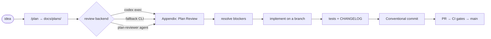

<div align="center">

# ⛬ RepoTemplate

### A strict, agent-ready project skeleton — disciplined version control, a mandatory plan-review gate, and CI/CD wired up from commit zero.

<br/>


</div>

---

**RepoTemplate** is a language-agnostic project skeleton that enforces one hard
workflow for humans and AI agents alike: **plan → review → implement**, on a
branch, with Conventional Commits, a maintained changelog, and a protected `main`.
Drop your code into `src/` — the structure and the rules are the product.

> The README is the overview. For the low-level reference, see the
> **[`docs/` wiki](./docs)**.

## ⚙️ Core requirements

Most of the template runs with nothing installed. The one external dependency is
the **plan-review step**, which prefers the OpenAI **Codex CLI**.

| Need | Why | How |
|------|-----|-----|
| **Codex CLI** | Runs `codex exec` to review plans | `npm install -g @openai/codex` |
| **Codex auth** | Codex must authenticate | `codex login` **or** export `OPENAI_API_KEY` |
| `CODEX_REVIEW_MODEL` *(optional)* | Pick the review model | default `gpt-5.3-codex` |
| `git` + Bash | Everything else | already on your machine |

```bash
npm install -g @openai/codex
export OPENAI_API_KEY=sk-...          # or run: codex login
```

No Codex? The review still happens via a fallback CLI or the `plan-reviewer`
agent — see **[docs/guide/plan-review.md](./docs/guide/plan-review.md)**.

> 🔒 **Never commit secrets.** `.env` and `*.key`/`*.pem` are git-ignored and
> `.claude/settings.json` denies reading them. Keep tokens in your shell env or a
> secrets manager.

## 🚀 Quick start

```bash
# "Use this template" on GitHub (recommended), or clone:
git clone <your-repo-url> && cd <your-repo>
chmod +x scripts/*.sh        # only needed after a raw zip download

./scripts/bootstrap.sh       # install deps   (wire the stub to your stack)
./scripts/lint.sh            # lint + format
./scripts/test.sh            # tests
```

Read **`CLAUDE.md`** first — it's the contract every contributor follows.

## 🔁 Workflow



1. **Plan** non-trivial work → a file in `docs/plans/` (`/plan`).
2. **Review** it → `scripts/codex-review.sh <plan>` appends `## Appendix: Plan
   Review` to the plan. Resolve blockers before coding.
3. **Implement** surgically on a branch; write tests; update `CHANGELOG.md`.
4. **Commit** with Conventional Commits — CI lints commits and the changelog.
5. **Merge** to protected `main` via PR with green CI.
6. **Release** by tagging `vX.Y.Z`; notes come from the changelog.

| Command | Does |
|---------|------|
| `scripts/codex-review.sh <plan>` | Review a plan → appendix (Codex or fallback) |
| `scripts/test.sh` / `scripts/lint.sh` | Test / lint (wire to your stack) |
| `scripts/check-changelog.sh` | Fail if source changed without a changelog entry |
| `scripts/setup-branch-protection.sh` | Set `main` default + apply the ruleset |

## 🗂️ Layout

```
.
├── CLAUDE.md / AGENTS.md   # operating contract (source of truth + tool-neutral mirror)
├── VERSIONING.md           # Conventional Commits + SemVer + releases
├── CHANGELOG.md            # Keep a Changelog
├── .claude/                # settings · agents · slash commands
├── .github/                # workflows · rulesets · issue/PR templates · CODEOWNERS
├── docs/                   # the wiki: architecture · adr · plans · guide
├── scripts/                # bootstrap · test · lint · codex-review · check-changelog · setup-branch-protection
├── src/  tests/            # your code · your tests
└── offline/                # git-ignored local scratch (only its README is tracked)
```

<details>
<summary><b>🛡️ Default branch &amp; branch protection</b></summary>

<br/>

The default branch is **`main`**, so any repo created via *"Use this template"*
starts on `main`. GitHub does **not** copy branch rules to new repos, so apply
them once (no direct pushes, green CI required, no force-push, no deletion,
linear history):

```bash
scripts/setup-branch-protection.sh            # uses gh; or: ... owner/repo
# UI: Settings → Rules → Rulesets → Import → .github/rulesets/main-branch-protection.json
```

Full detail: **[docs/guide/branch-protection.md](./docs/guide/branch-protection.md)**.

</details>

<details>
<summary><b>✅ Customize before you ship</b></summary>

<br/>

- [ ] `LICENSE` — copyright holder (defaults to MIT / "aradex").
- [ ] `.github/CODEOWNERS` — uncomment + set real owners (ships inert).
- [ ] `CHANGELOG.md` — replace the `OWNER/REPO` link reference.
- [ ] `scripts/{bootstrap,test,lint}.sh` — wire to your stack (see note).
- [ ] `docs/architecture/overview.md` — describe your real system.

> ⚠️ **Script stubs.** `bootstrap.sh`, `test.sh`, and `lint.sh` ship as no-op
> stubs that **exit 0**, so CI is green out of the box. Until you wire them up,
> lint/test **check nothing** — replace the bodies before trusting CI.

</details>

## 📚 Documentation

| Where | What |
|-------|------|
| **[`CLAUDE.md`](./CLAUDE.md)** / [`AGENTS.md`](./AGENTS.md) | The operating contract (read first) |
| **[`docs/`](./docs)** | The wiki — low-level reference for every mechanism |
| [`VERSIONING.md`](./VERSIONING.md) | Commits, SemVer, releases |
| [`CONTRIBUTING.md`](./CONTRIBUTING.md) | Human contributor guide |

## 📄 License

[MIT](./LICENSE) © aradex — free to use, modify, and distribute.
